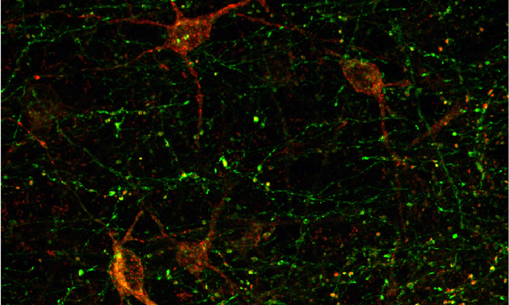

# Petrulis - de Vries Lab

**Sex differences in Neural Control of Social Behavior and Communication**

Welcome to the GitHub organization of the [Petrulis - de Vries Lab](https://www.petrulis-devrieslab.com/) at the Neuroscience Institute, Georgia State University, Atlanta, Georgia.

[Aras Petrulis](https://cas.gsu.edu/profile/aras-petrulis/) and [Geert J. de Vries](https://cas.gsu.edu/profile/geert-de-vries/) run a collaborative laboratory exploring the neural regulation of social and communicative behavior, with an emphasis on sex differences in these processes. Current projects focus on the role of the neuropeptide vasopressin (AVP) and its receptor systems — particularly the vasopressin 1a receptor (V1aR) — in the regulation of social, communicative, and emotional behavior in mice.

This work is funded by the National Institute of Mental Health (R01 MH135553) and the GSU Brains and Behavior Program.

## Repositories

This organization hosts data and code repositories associated with publications and preprints from the lab. Each repository contains raw data, analysis scripts, and documentation to support open and reproducible science.

## Contact

Neuroscience Institute, Georgia State University
100 Piedmont Avenue SE, Atlanta, Georgia 30303

📧 apetrulis@gsu.edu
🌐 [petrulis-devrieslab.com](https://www.petrulis-devrieslab.com/)
